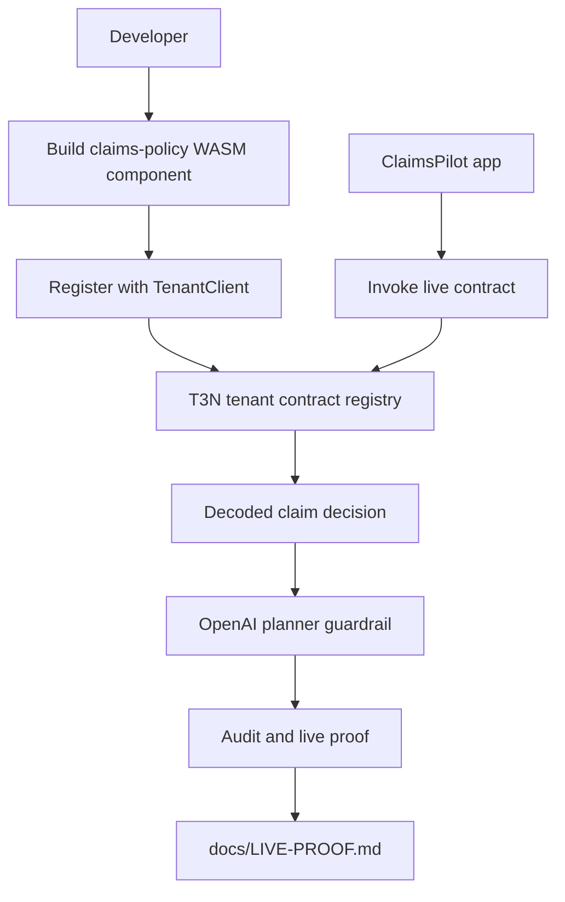
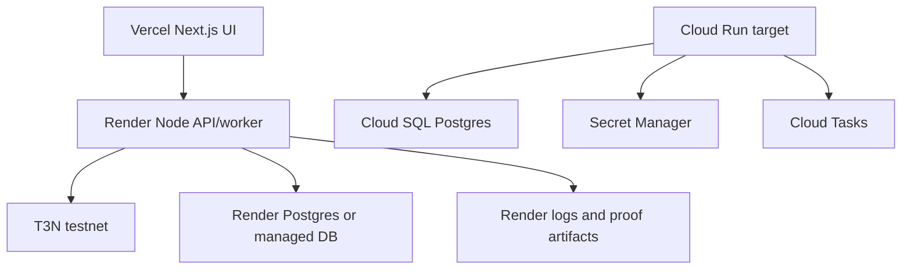

# feat: Add Real T3N Contract Publish and Invoke Path

## Summary

This plan converts ClaimsPilot's Rust policy skeleton into a real Terminal 3 tenant contract, adds live register/invoke scripts, wires the app to distinguish live contract decisions from local demo decisions, and documents the deploy path. The first hosted target is Vercel for the UI plus Render for the backend/API worker; Cloud Run remains the insurer-ready production target after the hack proof is stable.

---

## Problem Frame

ClaimsPilot currently proves live Terminal 3 SDK authentication and live OpenAI narration, but claim decisions still run through local TypeScript. The build needs a non-mock T3N contract artifact that can be registered and invoked on testnet, because the bounty criteria reward SDK integration completeness and because insurers will ask where enforcement actually happens.

---

## Requirements

**Live T3N contract**

- R1. Build `contracts/claims-policy` as a `wasm32-wasip2` WASM component.
- R2. Add a `wit/world.wit` world exporting claim contract functions through the Terminal 3 `contracts` interface.
- R3. Keep the Rust policy logic native-testable while adding WASM export bindings.
- R4. Register the component with `TenantClient` and persist public-safe registration metadata.
- R5. Invoke the registered contract for approved and escalated/denied claim scenarios.

**Application integration**

- R6. Reuse the existing T3 SDK setup pattern and never derive tenant DID from wallet material.
- R7. Add a live contract decision path that cannot be overridden by the OpenAI planner.
- R8. Preserve local demo mode for recording and fallback when live T3N is unavailable.
- R9. Add audit/proof output that identifies whether a decision came from live T3N or local demo policy.

**Deployment**

- R10. Document and support a bare-minimum Vercel+Render deployment path.
- R11. Document Cloud Run as the production-grade target for insurer use.
- R12. Keep secrets out of committed files, proof docs, and runtime logs.

---

## Key Technical Decisions

- **Use Terminal 3's WASI Preview 2 component pattern:** The official docs and `Terminal-3/z-tenant-flight` sample compile with `wasm32-wasip2`, `wit-bindgen`, `crate-type = ["cdylib", "lib"]`, and a `contracts` WIT export. This matches the current SDK and avoids inventing a wrapper format.
- **Start with policy-only live invocation:** Policy-only invocation proves live contract execution without being blocked by grant/profile setup for outbound `http-with-placeholders`. Placeholder egress becomes the second milestone, not a blocker.
- **Keep local TypeScript policy as fallback and parity oracle:** The TypeScript policy remains useful for demo mode, tests, and comparing live contract output during rollout.
- **Put SDK control-plane code behind scripts and shared helpers:** Registration and invocation need authenticated Node runtime behavior, secret access, explicit WASM loading, and consistent error normalization. That belongs in reusable server-only helpers plus scripts, not browser code.
- **Use Vercel+Render first, then Cloud Run:** Vercel gives fast Next.js hosting and Render gives a predictable Node backend/worker for SDK/WASM operations. Cloud Run is the production target once the proof is stable because it gives a cleaner IAM, secret, audit, database, and queue story for insurers.

---

## High-Level Technical Design





---

## Output Structure

```text
contracts/claims-policy/
  wit/world.wit
  src/lib.rs
  src/policy.rs
  Cargo.toml
scripts/
  t3-register-contract.ts
  t3-invoke-contract.ts
lib/t3/
  client.ts
  contract.ts
  contract-state.ts
app/api/t3/contract/
  status/route.ts
  invoke/route.ts
docs/
  LIVE-PROOF.md
  TERMINAL3-INTEGRATION.md
  DEPLOYMENT.md
```

The tree is the expected shape. Implementation can adjust file splits if the SDK surface or tests make a different split cleaner.

---

## Implementation Units

### U1. Convert Rust Policy Into a WASI Component

- **Goal:** Make `contracts/claims-policy` build as a T3N-compatible WASM component while preserving native unit tests.
- **Requirements:** R1, R2, R3
- **Dependencies:** None
- **Files:** `contracts/claims-policy/Cargo.toml`, `contracts/claims-policy/wit/world.wit`, `contracts/claims-policy/src/lib.rs`, `contracts/claims-policy/src/policy.rs`, `contracts/claims-policy/README.md`
- **Approach:** Add `wit-bindgen`, release-size settings, and a WIT world modeled on the Terminal 3 sample. Move pure policy logic into a native-testable module, then expose WASM-only `contracts` functions that parse `generic-input`, call policy logic, and serialize JSON bytes.
- **Patterns to follow:** `Terminal-3/z-tenant-flight` `wit/world.wit`, `Cargo.toml`, and `src/lib.rs`; current policy behavior in `contracts/claims-policy/src/lib.rs`; TypeScript parity in `lib/domain/policy.ts`.
- **Test scenarios:**
  - Native test approves a valid claim input.
  - Native test escalates an over-limit claim.
  - Native test denies an inactive policy or unauthorized agent.
  - WASM build produces `target/wasm32-wasip2/release/claims_policy.wasm`.
  - Optional interface verification shows `export contracts`.
- **Verification:** The contract builds for `wasm32-wasip2`, native Rust tests still pass, and the WIT export names match the invoke plan.

### U2. Add Shared T3 Contract Client Helpers

- **Goal:** Centralize live T3N contract authentication, tenant client creation, script naming, version handling, and error redaction.
- **Requirements:** R4, R6, R12
- **Dependencies:** U1
- **Files:** `lib/t3/client.ts`, `lib/t3/contract.ts`, `lib/t3/errors.ts`, `lib/t3/client.test.ts`, `lib/t3/contract.test.ts`
- **Approach:** Reuse the existing status adapter's SDK setup, but expose a server-only helper that returns authenticated `T3nClient`, `TenantClient`, session DID, address, environment, and canonical script name. Read tenant DID from `authenticate()` output. Validate tails before registration and redact API keys in errors.
- **Patterns to follow:** Existing explicit SDK WASM loading in `lib/t3/client.ts`; Terminal 3 setup guide; installed SDK types for `TenantClient`, `ContractPublishInput`, and `ContractExecuteInput`.
- **Test scenarios:**
  - Missing API key returns a controlled configuration error without throwing a raw SDK error.
  - Tail validation rejects slashes and prefixed `z:<tid>:` values.
  - Tenant DID helper prefers authenticated session DID over environment DID.
  - Error normalization redacts OpenAI and T3N-style secret material.
- **Verification:** Unit tests cover config, tail validation, DID handling, and redaction without making live network calls.

### U3. Add Register Contract Script

- **Goal:** Register the built WASM component on T3N testnet and persist public-safe metadata for later invocation.
- **Requirements:** R4, R6, R12
- **Dependencies:** U1, U2
- **Files:** `scripts/t3-register-contract.ts`, `package.json`, `.env.example`, `.gitignore`, `docs/LIVE-PROOF.md`, `docs/TERMINAL3-INTEGRATION.md`
- **Approach:** Add an npm script that reads the built WASM, authenticates, registers with `tenant.contracts.register`, records tail/version/script name/contract identifier when returned, and writes sanitized state under `.claimspilot-state/`. On version conflict, fail with a clear bump-version instruction.
- **Patterns to follow:** `scripts/verify-setup.ts` for env validation style; Terminal 3 register guide; current `.claimspilot-state` ignored local state pattern.
- **Test scenarios:**
  - Missing WASM path exits with a clear build-first error.
  - Missing T3N API key exits with a secret-safe setup error.
  - Version conflict error maps to a bump-version message.
  - Successful mocked registration writes state without storing raw API keys.
- **Verification:** A live run can produce registration proof on testnet, and `docs/LIVE-PROOF.md` has a safe place to paste the sanitized output.

### U4. Add Invoke Contract Script

- **Goal:** Invoke the registered claims contract from Node and print sanitized live proof for approved and escalated/denied claims.
- **Requirements:** R5, R7, R8, R9, R12
- **Dependencies:** U2, U3
- **Files:** `scripts/t3-invoke-contract.ts`, `lib/t3/contract.ts`, `lib/domain/seed.ts`, `package.json`, `docs/LIVE-PROOF.md`
- **Approach:** Read registration state, resolve the current script version when needed, submit sanitized claim/grant input, decode the contract response, and compare it against the local policy fallback. Keep proof output compact and safe for docs/video.
- **Patterns to follow:** Terminal 3 invoke guide; current seed claims and grants; `lib/agent/planner.ts` guardrail behavior.
- **Test scenarios:**
  - Missing registration state tells the developer to run registration first.
  - Approved seed claim returns an approved decoded result in mocked SDK tests.
  - Over-limit seed claim returns needs-escalation or denied in mocked SDK tests.
  - Local parity mismatch is visible as a warning, not silently ignored.
- **Verification:** A live testnet invoke prints sanitized approved and escalated/denied outputs that can be copied into `docs/LIVE-PROOF.md`.

### U5. Wire Live Contract Decisions Into the App

- **Goal:** Let the app use live T3N contract decisions when configured, while preserving deterministic demo fallback.
- **Requirements:** R7, R8, R9
- **Dependencies:** U2, U4
- **Files:** `app/api/claims/evaluate/route.ts`, `app/api/t3/contract/status/route.ts`, `app/api/t3/contract/invoke/route.ts`, `app/dashboard/t3-status/page.tsx`, `app/dashboard/agent/page.tsx`, `lib/domain/store.ts`, `lib/domain/store.test.ts`, `lib/agent/planner.test.ts`
- **Approach:** Add a server-side decision source that selects live contract invocation when `CLAIMSPILOT_DEMO_MODE=false` and registration state exists. Store the decision source and script/version proof in audit rows. Keep OpenAI planner output constrained to explanation fields.
- **Patterns to follow:** Current `/api/t3/status` route; current local policy audit flow; existing live OpenAI fallback in `lib/agent/planner.ts`.
- **Test scenarios:**
  - Demo mode keeps using local policy.
  - Live mode with registration state attempts contract invocation.
  - Live contract failure falls back only when configured, and the audit row marks the fallback.
  - OpenAI response cannot change a live contract decision.
- **Verification:** Dashboard surfaces live contract status, claim evaluation can show live T3N as source, and existing demo flow remains usable.

### U6. Add Placeholder Outbound Contract Milestone

- **Goal:** Prepare the next proof layer where approved claims call an insurer endpoint via Terminal 3 placeholder resolution.
- **Requirements:** R5, R7, R9, R12
- **Dependencies:** U1, U4
- **Files:** `contracts/claims-policy/wit/world.wit`, `contracts/claims-policy/src/lib.rs`, `contracts/claims-policy/src/policy.rs`, `app/api/mock-insurer/claims/route.ts`, `app/api/mock-insurer/payouts/route.ts`, `docs/TERMINAL3-INTEGRATION.md`
- **Approach:** Add `http-with-placeholders` to WIT only when the contract function needs outbound insurer calls. Keep claim decision invoke policy-only until grant/profile setup is proven. Document the self-grant or delegated grant requirement for allowed hosts.
- **Patterns to follow:** Terminal 3 `http-with-placeholders` sample in `z-tenant-flight`; current mock insurer routes; current placeholder list in `docs/TERMINAL3-INTEGRATION.md`.
- **Test scenarios:**
  - Contract input rejects or ignores raw PII fields.
  - Placeholder payload contains allowed markers only.
  - Missing host grant returns an egress-denied proof instead of falling back to direct HTTP.
  - Successful mocked outbound call returns sanitized insurer result.
- **Verification:** The codebase has a clear path from policy-only live proof to placeholder outbound proof without changing the product story.

### U7. Document Minimum Vercel+Render Deployment

- **Goal:** Create the fastest credible hosted path for the bounty.
- **Requirements:** R10, R12
- **Dependencies:** U3, U4, U5
- **Files:** `docs/DEPLOYMENT.md`, `README.md`, `.env.example`, `next.config.ts`, `package.json`
- **Approach:** Document Vercel for the Next.js UI and Render for SDK/WASM backend/API or worker execution. Keep live T3N SDK calls in Node runtime, not Edge. Define env variable ownership, secret handling, build commands, health checks, and how to run registration/invocation from Render.
- **Patterns to follow:** Existing Next.js server external package config; Vercel Next.js docs; Render web services, background workers, private networking, and secrets docs.
- **Test scenarios:** Test expectation: none -- documentation and deployment configuration only, unless implementation adds deployment-specific code.
- **Verification:** A teammate can deploy the UI and backend using the doc without committing secrets or moving SDK calls into an unsupported runtime.

### U8. Document Cloud Run Production Strategy

- **Goal:** Add the insurer-ready deployment path that improves on the hackathon minimum.
- **Requirements:** R11, R12
- **Dependencies:** U7
- **Files:** `docs/DEPLOYMENT.md`, `HANDOFF.md`, `docs/SUBMISSION.md`
- **Approach:** Document Cloud Run service for the app/API, Cloud SQL for audit/proof data, Secret Manager for keys, Cloud Tasks for contract work, and Cloud Run Jobs for migrations or registration. Position this as the next production step after Vercel+Render proof, not a blocker for submission.
- **Patterns to follow:** Google Cloud Run service/job docs; Cloud SQL from Cloud Run docs; Secret Manager integration; Cloud Tasks authenticated HTTP target docs.
- **Test scenarios:** Test expectation: none -- architecture documentation only in this plan.
- **Verification:** Submission and handoff docs can explain why Vercel+Render is enough for the bounty demo and why Cloud Run is the insurer path.

### U9. Update Live Proof, Handoff, and Submission Docs

- **Goal:** Make the final story easy for judges and the teammate to verify.
- **Requirements:** R4, R5, R9, R10, R11, R12
- **Dependencies:** U3, U4, U5, U7, U8
- **Files:** `docs/LIVE-PROOF.md`, `docs/DEMO-SCRIPT.md`, `docs/SUBMISSION.md`, `docs/TERMINAL3-INTEGRATION.md`, `HANDOFF.md`, `README.md`
- **Approach:** Add a live proof section for registration and invocation outputs, update the demo script to show live contract status before the agent narrative, and make the handoff explicit about current proof level and remaining outbound placeholder work.
- **Patterns to follow:** Existing concise docs; current `HANDOFF.md` warning style about rotating secrets.
- **Test scenarios:** Test expectation: none -- documentation-only changes.
- **Verification:** A judge can follow the docs from setup to live contract proof, and Parshiv can tell which pieces are complete versus intentionally deferred production hardening.

---

## Scope Boundaries

### Active Scope

- Build, register, and invoke a real T3N contract on testnet.
- Keep the live proof safe to paste into docs and video scripts.
- Add minimum hosted deployment guidance for Vercel+Render.
- Add Cloud Run production guidance for insurer credibility.

### Deferred to Follow-Up Work

- Full Cloud Run Terraform, VPC, and observability implementation.
- Real insurer credentials and production partner API integration.
- Full user grant UX for delegated third-party callers.
- Moving all audit/proof storage from local JSON to managed Postgres.

### Out of Scope

- Rebuilding ClaimsPilot as a full claims administration system.
- Replacing OpenAI narration with a different model provider.
- Publishing secrets, API keys, or raw claimant PII in proof docs.

---

## Risks & Dependencies

- **Terminal 3 SDK/document drift:** The docs and installed SDK must be checked during implementation because SDK releases may move control-plane helper names.
- **Grant setup may block outbound egress:** Policy-only invoke should ship first so the build has live proof even if placeholder outbound setup takes longer.
- **Version conflicts are expected during iteration:** Registration scripts need clear semver bump instructions.
- **Vercel runtime mismatch:** SDK/WASM contract operations should stay on Node server runtime or Render, not Vercel Edge.
- **Secret leakage risk:** Existing keys were pasted in chat and should be rotated before any public demo or teammate handoff.

---

## Operational Notes

- Run live contract scripts only with `CLAIMSPILOT_T3_ENVIRONMENT=testnet` for the bounty.
- Keep `CLAIMSPILOT_DEMO_MODE=true` available for backup recording.
- Store registration state under `.claimspilot-state/`, which must remain ignored.
- Treat `docs/LIVE-PROOF.md` as public-safe evidence only.
- For Vercel+Render, Render owns live SDK/WASM operations and Vercel owns UI delivery.
- For Cloud Run, use one container image for app/API first, then split workers/jobs only when queue volume or operations demand it.

---

## Sources & Research

- Origin requirements: `docs/brainstorms/2026-06-15-real-t3n-contract-requirements.md`
- Current SDK auth adapter: `lib/t3/client.ts`
- Current policy fallback: `lib/domain/policy.ts`
- Current Rust skeleton: `contracts/claims-policy/src/lib.rs`
- Current integration docs: `docs/TERMINAL3-INTEGRATION.md`
- Terminal 3 ADK overview: https://docs.terminal3.io/developers/adk/overview/what-is-adk
- Terminal 3 setup guide: https://docs.terminal3.io/developers/adk/get-started/prerequisites/set-up-dev-env
- Terminal 3 write/build/register/invoke guides: https://docs.terminal3.io/developers/adk/get-started/walkthrough/write-contract
- Terminal 3 common errors: https://docs.terminal3.io/developers/adk/tips/common-errors
- Terminal 3 sample: https://github.com/Terminal-3/z-tenant-flight
- Vercel Next.js deployment docs: https://vercel.com/docs/frameworks/full-stack/nextjs
- Render background worker docs: https://render.com/docs/background-workers
- Render compliance docs: https://render.com/docs/certifications-compliance
- Google Cloud Run overview: https://docs.cloud.google.com/run/docs/overview/what-is-cloud-run
- Cloud SQL from Cloud Run docs: https://docs.cloud.google.com/sql/docs/postgres/connect-run
- Cloud Run Secret Manager docs: https://docs.cloud.google.com/run/docs/configuring/services/secrets
- Cloud Tasks HTTP target docs: https://docs.cloud.google.com/tasks/docs/creating-http-target-tasks
