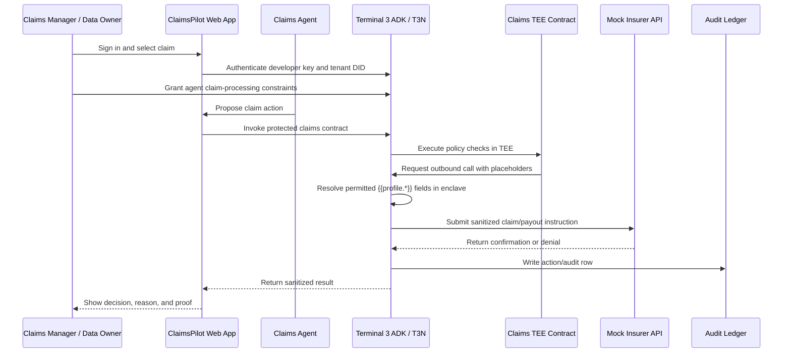

# ClaimsPilot Plan

## Summary

Build **ClaimsPilot**, a Terminal 3 ADK bounty submission where an AI insurance claims agent can prepare and submit claim actions, but cannot see sensitive claimant data or execute payouts outside explicit user-granted constraints.

The official Terminal 3 framing changes the plan in one important way: this should be a **T3 ADK protected-action app**, not mainly a Better Auth Agent Auth app. Terminal 3 describes ADK as an identity + action layer that wraps outbound agent actions, verifies identity, substitutes sensitive references inside a TEE, and writes audit rows before the destination system sees the request. The docs also explicitly list **insurance claim management** as a relevant AI-agent transaction use case.

Primary objective: win the build track. Secondary objective: produce a clean bug-bounty report from real SDK/docs friction encountered while building.

## Why This Is The Right Wedge

ClaimsPilot beats generic governance because it gives judges an immediate enterprise story:

- Claims are PII-heavy, approval-heavy, and money-moving.
- The agent must inspect policy context without leaking identity, bank, medical, or document data into prompts.
- The final action is dangerous enough to make allow/deny/escalate/revoke meaningful.
- Terminal 3 is visibly necessary: DID identity, TEE contract execution, `http-with-placeholders`, user delegation grants, egress authorization, and auditability.

Avoid building another procurement or shopping-cap agent. BoundBuyer and SpendPass already own that mental slot.

## Official Terminal 3 Alignment

Use these official signals as the product spine:

- **ADK purpose:** build safe AI agents that identify themselves, access user-authorized data, and perform real-world actions without exposing sensitive information to the model, application, or agent runtime.
- **Sandbox value prop:** 20,000 test tokens, enough for agent identities and protected actions; full SDK access; test merchant/payment-style flows.
- **Core technical primitive:** `@terminal3/t3n-sdk` with `T3nClient`, `loadWasmComponent`, `setEnvironment`, `createEthAuthInput`, `eth_get_address`, `metamask_sign`, `handshake`, `authenticate`, and `getUsage`.
- **TEE contract model:** tenant identity, tenant-scoped KV maps, Rust-to-WASM contracts, contract publish/execute lifecycle, cross-tenant calls.
- **Private data path:** `http-with-placeholders` resolves `{{profile.*}}` values inside the enclave so plaintext PII never enters WASM or the agent.
- **Authorization model:** outbound HTTP egress is authorized by the calling user's grant, not by the contract alone; missing allowed-host grants must produce clear denials.
- **Host API model:** contracts are capability-limited; if a capability is not granted/exposed, the contract cannot do it.

Sources:

- Terminal 3 ADK product page: https://www.terminal3.io/products/agent-developer-kit
- About Terminal 3: https://docs.terminal3.io/intro/about-t3
- ADK overview: https://docs.terminal3.io/developers/adk/overview/what-is-adk.md
- Why ADK: https://docs.terminal3.io/developers/adk/overview/why-adk.md
- Delegate access to AI agents: https://docs.terminal3.io/t3n/use-cases/delegate-access-to-agent.md
- Host API: https://docs.terminal3.io/t3n/how-t3n-works/host-api.md
- Placeholder outbound calls: https://docs.terminal3.io/developers/adk/tips/placeholders-outbound-calls.md
- Outbound HTTP auth by user: https://docs.terminal3.io/developers/adk/tips/outbound-http-auth-by-user.md

## Product Story

One-liner:

> ClaimsPilot is an AI claims adjuster that can investigate and submit claim decisions, but payout execution and private claimant data are governed by Terminal 3 TEE contracts, user grants, and auditable protected actions.

Judge demo story:

1. Claims manager connects an AI claims agent.
2. User grants the agent permission to process phone-damage claims up to `$750`, only for approved regions, only when claimant identity and policy status are verified.
3. Agent approves a `$420` claim.
4. Agent attempts a `$4,800` medical claim and gets blocked.
5. Agent requests escalation.
6. User grants a higher limit for that claim type.
7. Agent retries and succeeds.
8. User revokes the agent.
9. Old agent action fails.
10. Audit page shows every allow, deny, escalation, and revocation.

## Architecture

## Core Requirements

### R1. Terminal 3 First

The core path must use `@terminal3/t3n-sdk` and T3N concepts directly:

- authenticate with T3N using the documented Ethereum signing flow
- show tenant DID and token usage status
- publish or invoke a claims TEE contract
- use tenant KV maps for policy/audit state where practical
- make Terminal 3 denial modes visible instead of hiding them behind app logic

### R2. TEE-Enforced Claims Policy

The policy decision must not live only in the chat prompt or frontend.

The claims contract should enforce:

- agent DID matches the grant
- claim type is allowed
- payout amount is under the granted cap
- policy status is active
- identity verification is present
- allowed host exists before external claim execution
- replay/idempotency key prevents double payout in demo flow

### R3. Private Data Never Enters Agent Context

Use `http-with-placeholders` as the flagship technical proof.

The contract submits placeholders such as:

- `{{profile.first_name}}`
- `{{profile.last_name}}`
- `{{profile.date_of_birth}}`
- `{{profile.verified_contacts.email.value}}`

The agent UI must show only redacted or hashed proof values. The demo should explicitly show that plaintext PII is not in the agent prompt, browser state, or contract payload.

### R4. Judge-Friendly Full Loop

The app must include:

- live status panel
- seeded claims queue
- chat/agent panel
- grant/authorization panel
- denial matrix
- audit dashboard
- demo script
- submission narrative

No placeholders in README. No "set deployed URL here" nonsense.

### R5. Bug Bounty Ledger

Maintain a separate `BUGS.md` while building.

Only include bugs that are:

- SDK/docs/onboarding related
- reproducible on current docs/packages
- actionable
- verifiable from logs, commands, screenshots, or minimal repros
- not duplicates of previous Houdini/SpendPass findings

## Implementation Plan

### U1. Greenfield App Foundation

**Goal:** Create a clean Next.js app that can carry the whole demo.

**Files:**

- `package.json`
- `app/`
- `components/`
- `lib/domain/`
- `.env.example`
- `scripts/seed.ts`
- `scripts/verify-setup.ts`

**Approach:**

- Use Next.js App Router.
- Use a deterministic local JSON store for demo data, with no fake database dependency.
- Seed claims, claimants, policies, agents, grants, payout attempts, and audit rows.
- Add setup verification that checks env vars, seed state, and T3 SDK availability.

**Test scenarios:**

- Seed script is repeatable.
- Verify script fails clearly when env or DB is missing.
- Verify script confirms seeded low-value and high-value claims exist.
- Dashboard renders seeded claims after setup.

### U2. Terminal 3 SDK Adapter

**Goal:** Isolate all T3N SDK behavior behind a small adapter so SDK friction is contained and bug reports are easy to capture.

**Files:**

- `lib/t3/client.ts`
- `lib/t3/status.ts`
- `lib/t3/errors.ts`
- `lib/t3/__tests__/client.test.ts`
- `app/dashboard/t3-status/page.tsx`

**Approach:**

- Implement documented SDK flow: `setEnvironment("testnet")`, derive address from `T3N_API_KEY`, load WASM component, create `T3nClient`, `handshake`, `authenticate(createEthAuthInput(address))`, `getUsage`.
- Expose `mode: "live" | "demo" | "error"` honestly.
- Never silently claim live mode when credentials fail.
- Persist the tenant DID/status for display.

**Test scenarios:**

- Missing key returns demo/error state, not fake live status.
- SDK authentication success returns DID and token usage.
- SDK failure maps to actionable UI copy.
- Adapter redacts private key/API key from logs.

### U3. Claims TEE Contract

**Goal:** Add the Rust/WASM claims policy contract that enforces the critical allow/deny logic.

**Files:**

- `contracts/claims-policy/`
- `contracts/claims-policy/wit/`
- `contracts/claims-policy/src/`
- `contracts/claims-policy/tests/`
- `scripts/register-contract.ts`
- `scripts/invoke-contract.ts`

**Approach:**

- Contract input carries claim ID, requested payout amount, claim type, region, nonce/idempotency key, and grant proof/reference.
- Contract checks policy constraints and returns typed denial reasons.
- Contract records accepted nonce/spend state through KV where available.
- Use `http-with-placeholders` for the final mock insurer API call that needs claimant PII.
- Keep local contract tests independent from live network availability.

**Denial reasons:**

- `agent_not_authorized`
- `claim_type_not_allowed`
- `amount_over_limit`
- `policy_inactive`
- `identity_not_verified`
- `host_not_allowed`
- `replay_rejected`
- `placeholder_not_permitted`

**Test scenarios:**

- Valid phone claim under limit is approved.
- High-value medical claim is denied.
- Inactive policy is denied.
- Wrong agent DID is denied.
- Replayed nonce is denied.
- PII placeholder path never returns plaintext PII in contract result.

### U4. Grant And Delegation UI

**Goal:** Make authorization visible and judge-friendly.

**Files:**

- `app/dashboard/grants/page.tsx`
- `components/grants/GrantCard.tsx`
- `components/grants/GrantEditor.tsx`
- `lib/grants/`
- `lib/grants/__tests__/policy.test.ts`

**Approach:**

- Let judge create demo grants with payout cap, claim type, allowed region, allowed host, expiration, and revocation state.
- Store demo grants locally and mirror the shape expected by T3N invocation.
- Display the difference between app-level grant state and live T3N grant status.
- Explain missing allowed-host denial as a feature, not a crash.

**Test scenarios:**

- Grant form creates scoped permission.
- Expired grant blocks execution.
- Revoked grant blocks execution.
- Missing allowed host produces clear denial.
- Escalated grant supersedes lower cap only for the target claim type.

### U5. Claims Agent Workflow

**Goal:** Build the visible agent experience without letting the agent become the security boundary.

**Files:**

- `app/dashboard/agent/page.tsx`
- `app/api/agent/route.ts`
- `lib/agent/planner.ts`
- `lib/agent/tools.ts`
- `lib/agent/__tests__/planner.test.ts`

**Approach:**

- Agent can summarize claims, recommend decisions, and call protected actions.
- Agent cannot directly mutate payout state.
- All final actions route through the T3 adapter/contract invocation layer.
- Provide deterministic planner fallback when no LLM key is configured.
- Prompt should explicitly forbid invented claim facts, prices, identity status, or payout confirmations.

**Test scenarios:**

- Agent recommends approval for valid low-value claim.
- Agent recommends escalation for high-value claim.
- Agent cannot mark claim paid without contract approval.
- Agent response reflects exact contract denial reason.
- Missing LLM key uses deterministic demo planner and labels it.

### U6. Audit Dashboard And Proof Matrix

**Goal:** Show proof better than the competitors did.

**Files:**

- `app/dashboard/audit/page.tsx`
- `components/audit/`
- `lib/audit/`
- `lib/audit/__tests__/audit.test.ts`

**Approach:**

- Every attempt writes an audit event: allow, deny, escalate, revoke, live-status failure.
- Audit row includes agent DID, claim ID, grant ID, action, decision, denial reason, amount, host, mode, timestamp.
- UI groups events into a judge-readable matrix.

**Demo matrix:**

- Approve `$420` phone damage claim.
- Deny `$4,800` medical claim over cap.
- Deny inactive policy claim.
- Deny disallowed region claim.
- Deny missing allowed-host egress.
- Escalate and approve.
- Revoke and prove old grant fails.

**Test scenarios:**

- Every execution attempt creates one audit row.
- Denial rows include reason.
- Revocation creates an audit row.
- Audit UI distinguishes live T3N result from local demo result.

### U7. Mock Insurer API

**Goal:** Provide a realistic destination system for last-mile protected actions.

**Files:**

- `app/api/mock-insurer/claims/route.ts`
- `app/api/mock-insurer/payouts/route.ts`
- `lib/mock-insurer/`
- `lib/mock-insurer/__tests__/insurer.test.ts`

**Approach:**

- Mock insurer API accepts sanitized claim/payout instructions.
- It should receive resolved private fields only through the T3 placeholder flow in live mode.
- In demo mode, use clearly labeled fixture substitution.
- Return sanitized confirmation without echoing sensitive fields.

**Test scenarios:**

- Payout endpoint rejects missing idempotency key.
- Payout endpoint does not echo PII.
- Duplicate idempotency key does not double-pay.
- Mock response is sanitized before agent sees it.

### U8. Documentation And Submission Package

**Goal:** Remove every reason judges could misunderstand or distrust the submission.

**Files:**

- `README.md`
- `docs/DEMO-SCRIPT.md`
- `docs/SUBMISSION.md`
- `docs/TERMINAL3-INTEGRATION.md`
- `docs/LIVE-PROOF.md`

**Approach:**

- README first screen: problem, one-liner, quickstart, live URL, demo video, proof matrix.
- `TERMINAL3-INTEGRATION.md`: exact SDK calls, TEE contract, grants, allowed-host behavior, placeholder behavior.
- `LIVE-PROOF.md`: captured command outputs, DID, token usage, contract registration/invocation status.
- `DEMO-SCRIPT.md`: 3-5 minute judge walkthrough.
- Submission doc maps directly to criteria: completeness, SDK integration, creativity.

**Test scenarios:**

- README has no placeholders.
- Demo script can be followed by someone who did not build the app.
- Docs state live/demo boundary consistently.
- Submission narrative does not mix bug bounty into product pitch.

### U9. Bug Bounty Report

**Goal:** Capture Parfit’s lesson: bug reports should be byproducts of real integration, not random archaeology.

**Files:**

- `BUGS.md`
- `docs/repros/`
- `scripts/repro-doc-*`

**Approach:**

- Track issues while implementing U2-U4 and U8.
- Re-check against current docs and package versions before including.
- Use this structure per finding: title, scope, version, source, steps, expected, actual, impact, workaround, suggested fix, duplicate check.
- Do not submit duplicates from Houdini or SpendPass unless the current docs regressed and the repro is new.

**High-value bug lanes:**

- SDK setup examples that fail against current package types.
- Contract walkthrough steps that omit required maps/grants/host capability setup.
- `http-with-placeholders` docs/source mismatches.
- Allowed-host grant errors with unclear remediation.
- API key retrieval/onboarding footguns.
- Typed fields marked optional but required at runtime.
- Error tables without fixes.

**Test scenarios:**

- Every report includes exact package versions.
- Every report has a minimal repro command or captured output.
- Every report says why it is SDK/docs/onboarding related.
- Every report includes a suggested fix.

## Delivery Order

1. Build U1 foundation and seeded data.
2. Build U2 T3 status adapter before product UI gets big.
3. Build U3 contract and local tests.
4. Build U4 grants and U5 agent workflow.
5. Build U6 audit proof matrix.
6. Build U7 mock insurer destination.
7. Finish U8 documentation and live proof.
8. Finalize U9 bug report from real integration notes.

## Acceptance Criteria

- App has a live URL.
- README has no placeholders.
- Judge can run local demo with seeded data.
- T3 status panel shows DID/token usage when live credentials are configured.
- Claims contract has unit tests for every denial reason.
- Demo shows at least one successful protected action and five blocked actions.
- Audit page proves allow/deny/escalate/revoke lifecycle.
- Sensitive claimant fields do not appear in agent-visible output.
- `BUGS.md` contains only verified, in-scope, non-duplicate SDK/docs issues.

## Scope Boundaries

In scope:

- Insurance claims demo.
- Seeded claims and mock insurer API.
- T3 ADK SDK integration.
- TEE contract for policy enforcement.
- Placeholder-based private data proof.
- Audit dashboard.
- Bug report from integration friction.

Out of scope:

- Real insurer integration.
- Real payment processor settlement.
- Production-grade insurance adjudication.
- Multi-tenant enterprise admin beyond what the demo needs.
- Reusing Houdini as the submission.
- Procurement or shopping agent clone.

## Risks And Mitigations

| Risk | Mitigation |
| --- | --- |
| SDK/docs drift blocks live path | Build local contract tests and document live failure honestly; turn drift into bug report. |
| T3 grant setup is hard to demo | Add setup verifier and status panel with exact missing step. |
| App looks like mock security | Make T3 status, contract invocation, denial reasons, and placeholder proof first-class UI. |
| Scope balloons into real insurance platform | Keep seeded demo narrow: 6 claims, 1 mock insurer API, 1 contract. |
| Bug report distracts from build | Keep `BUGS.md` separate and product README clean. |
| Judges miss SDK depth | Add `TERMINAL3-INTEGRATION.md` and a README scoring table. |

## Final Submission Checklist

- Live app URL.
- Demo video.
- README quickstart.
- `docs/DEMO-SCRIPT.md`.
- `docs/SUBMISSION.md`.
- `docs/TERMINAL3-INTEGRATION.md`.
- `docs/LIVE-PROOF.md`.
- `BUGS.md`.
- No stale placeholder text.
- No contradictory live/demo claims.
- No copied prior submission framing.
